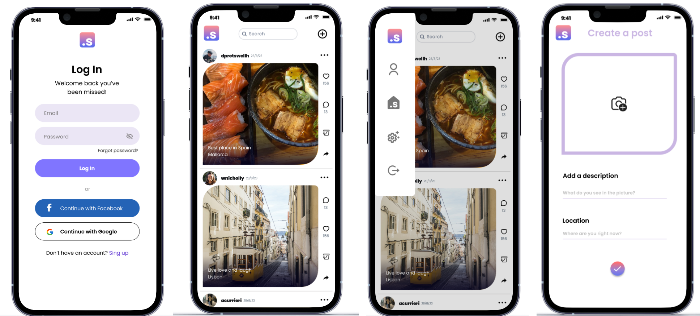
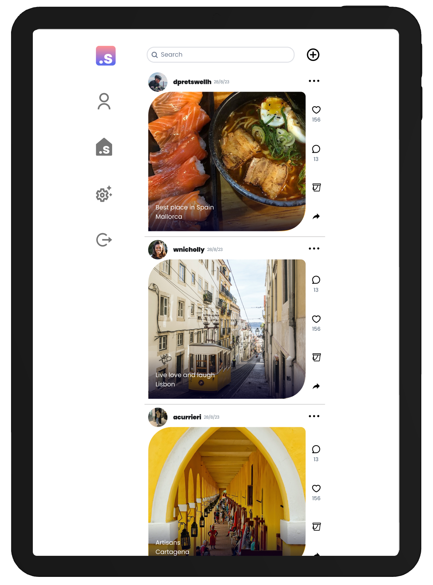
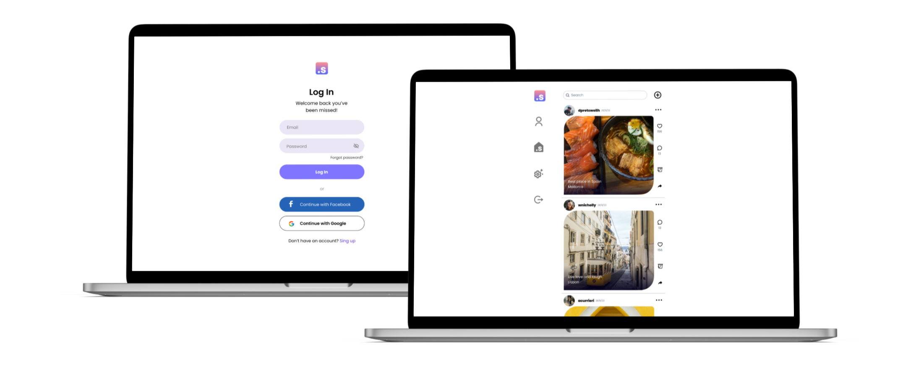
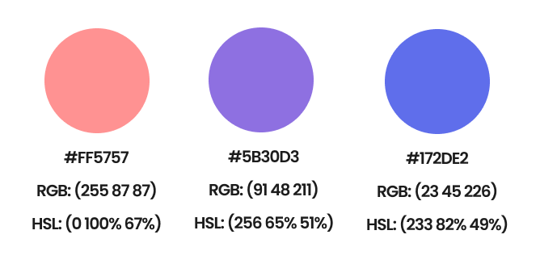
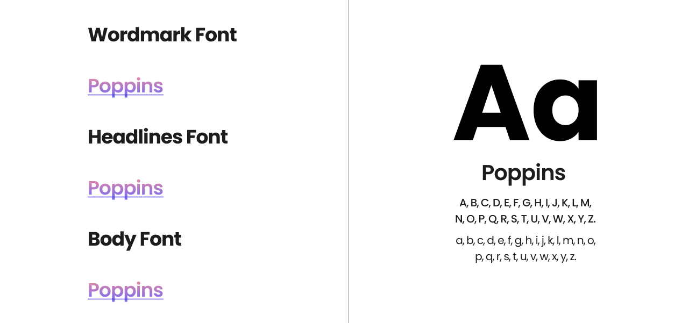
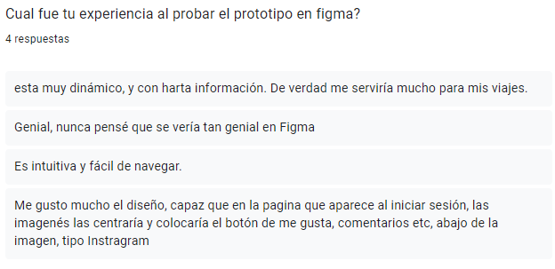
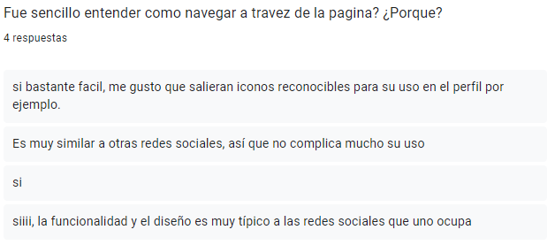
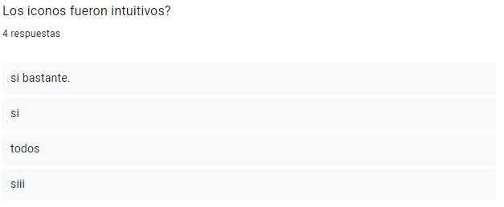
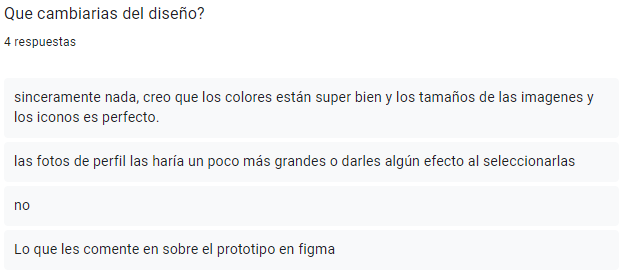
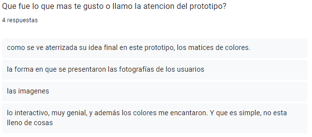

# Creando una Red Social

     

## Índice

* [1. Resumen del proyecto](#1-resumen-del-proyecto)
* [2. Consideraciones generales](#2-consideraciones-generales)
* [3. Definición del producto](#2-definición-del-producto)
* [4. Historias de usuario](#4-historias-de-usuario)
* [5. User Experience ](#5-user-experience)
* [6. Consideraciones técnicas Front-end](#6-consideraciones-técnicas-front-end)

## 1. Resumen del proyecto

* Desarrollar una SPA con temática de red social
* Aplicar los conceptos de responsividad en el desarrollo de las vistas (templates)
* Implementar un router para la navegación entre las diferentes vistas de la aplicación
* Emplear firebase como servicio externo para la persistencia de datos de la aplicación
* Crear una suite de pruebas unitarias que permitan testear código asíncrono

## 2. Consideraciones generales

* Este proyecto esta conformado por un equipo de dos desarrolladoras:  
[Lizbeth Peña](https://github.com/lizbethMelissaPS), [Alexandra Valdéz](https://github.com/AlexandraValdez)

* La lógica del proyecto debe esta implementada completamente en JavaScript
  (ES6+), HTML y CSS :smiley:. Para este proyecto **no está permitido** utilizar
  _frameworks_ o librerías de CSS y JS.

## 3. Definición del producto

¿Eres un viajero apasionado que ama compartir tus experiencias con otros? ¿Quieres conectarte con personas afines y descubrir nuevos destinos de viaje? ¡Te presentamos nuestra nueva aplicación de redes sociales Sonder! Diseñada específicamente para entusiastas del viaje!

Nuestra aplicación te permite crear un perfil y compartir tus experiencias de viaje con otros. Puedes publicar fotos, escribir sobre tus experiencias y proporcionar consejos y recomendaciones a otros viajeros. Conéctate con otros usuarios que comparten intereses similares e inspírate en sus historias de viaje.

Pero nuestra aplicación no se trata solo de compartir tus propias experiencias. También se trata de descubrir nuevos lugares para visitar y cosas que hacer. Explora contenido generado por los usuarios para encontrar joyas ocultas y destinos fuera de lo común. Busca consejos y recomendaciones de viaje para tu próxima aventura.

Nuestra aplicación también cuenta con una interfaz fácil de usar, lo que la hace fácil de navegar y usar.

### Hallazgos

En cuanto a los viajeros y las redes sociales, resulta sorprendente descubrir que 
- Casi el [85% de los millennials](https://www.ampagency.com/travel-research-whitepaper) utilizan las publicaciones sociales de otra persona al planificar sus vacaciones. 
- Alrededor del [43% de millenials](https://www.telegraph.co.uk/travel/news/millennials-social-media-holidays/) no se irá de vacaciones si no pueden estar seguros de que sus seguidores puedan ver sus publicaciones de vacaciones. 
- El 34% reserva un hotel porque lo vieron a través del contenido generado por el usuario.
- De acuerdo con una investigación reciente, las redes sociales se convirtieron en una parte vital de las operaciones estratégicas de las empresas de turismo durante la pandemia, y el consumo [aumentó en un 72%.](https://www.marketresearch.com/GlobalData-v3648/Social-Media-Travel-Tourism-Update-14871026/)
- Uno de los estudios revela que el [27% de los viajeros](https://www.researchgate.net/publication/266382179_The_Impact_of_Social_Media_on_Tourism) toman la decisión inicial de viajar a un destino específico gracias a publicaciones en Facebook.

## 4. Historias de usuario

**Primera HU**

**Como**: mochilera me gustaría registrarme a una red de viajeros como yo 

**Para**:  ver que lugares podria visitar en un futuro

- **Criterios de aceptación**
  - Visualizar formulario para registro de usuario
  - Registro del usuario
- **Definición de terminado:**
  - Validación del email con firebase
  - Creacion del usuario por email, google y facebook.
  - Tener un botón para registrarse con email, google y facebook.
  - Mostrar mensaje si hay algun error para registrarse

**Segunda HU**

**Como**: usuaria de sonder quiero porder acceder a mi cuenta a travez de mi laptop

**Para**:  acceder a ver todo el contenido 

- **Criterios de aceptación**
  - Visualizar formulario para iniciar sesion
  - Iniciar sesion
- **Definición de terminado:**
  - Debe ser responsive
  - Input de email y contraseña
  - Boton para iniciar sesion y redirigir al muro.
  - Iniciar sesion con email o google o facebook.
  - Mostrar mensaje si hay algun error para iniciar sesion.
  - Test unitarios.

**Tercera HU**

**Como**: fotógrafo me gustaría publicar las fotos de los lugares donde viajo y preguntar como mejorar mi fotografia

**Para**:  que la gente conozca sobre mi trabajo

- **Criterios de aceptación**
  - Crear publicacion con imagen, descripcion y ubicacion.
  - Ver publicacion 
- **Definición de terminado:**
  - Boton de navegacion hacia pagina de creacion del post.
  - Input para seleccionar una imagen
  - Botón para crear publicación.
  - Almacenar la publicacion en firestore.
  - Almacenar la url de la imagen en firebase storage.
  - Ver post en el muro con imagen, fecha, descripcion y ubicacion.

**Cuarta HU**
**Como**: nómade digital me gustaría inspirarme con diferentes publicaciones y poder dar like a las que me gustaron mas
**Para**:  ver cual seria mi proximo destino.

- **Criterios de aceptación**
  - Visualizar el boton con icono del like
  - Cambiar el estado del icono del like
- **Definición de terminado:**
  - Boton de like
  - Contador de likes 
  - Solo permitir un like por usuario

**Quinto HU**

**Como**: usuario distraido quiero borrar publicaciones antiguas  

**Para**:  que ya no se visualice en el muro.

- **Criterios de aceptación**
  - Visualizar el boton para eliminar
- **Definición de terminado:**
  - Boton de eliminar.
  - Eliminar solo publicaciones propias.
  - Pasar los test unitarios.

## 5. User Experience 

### Prototipo de baja fidelidad

Para diseñar el prototipo usamos la técnica de [_mobile first_](https://www.mediaclick.es/blog/diseno-web-responsive-design-y-la-importancia-del-mobile-first/) 

### Prototipo de alta fidelidad

Para diseñar el prototipo usamos [_`figma`_](#figma) 

***Celular:***

     

***Tablet:***

     

***Laptop:***

##### Paleta de colores

     

##### Fuente

## Testeos de usabilidad

Realizamos un test de usabilidad para evaluar la facilidad de uso de la plataforma. El objetivo fue observar cómo los usuarios interactúan con la plataforma e identificar cualquier problema de usabilidad que encuentren. Usamos google forms para realizar la encuesta para el test de usabilidad.

Estos fueron los principales hallazgos descubiertos por el estudio de usabilidad:

* Centrar la imagen de los posts
* Foto de perfil más grandes 
* Efecto que indique que se pudo dar like a la publicacion.

### 6. Consideraciones técnicas Front-end

#### Pruebas unitarias (unit tests)

* Recuerda que no hay un _setup_ de **tests** definido, dependerá de
  la estructura de tu proyecto. Algo que no debes de olvidar es pensar en éstas
  pruebas, te pueden ayudar a definir la estructura y nomenclatura de tu lógica.

* Los tests unitarios deben cubrir un mínimo del 70% de _statements_, _functions_,
  _lines_, y _branches_.

***

